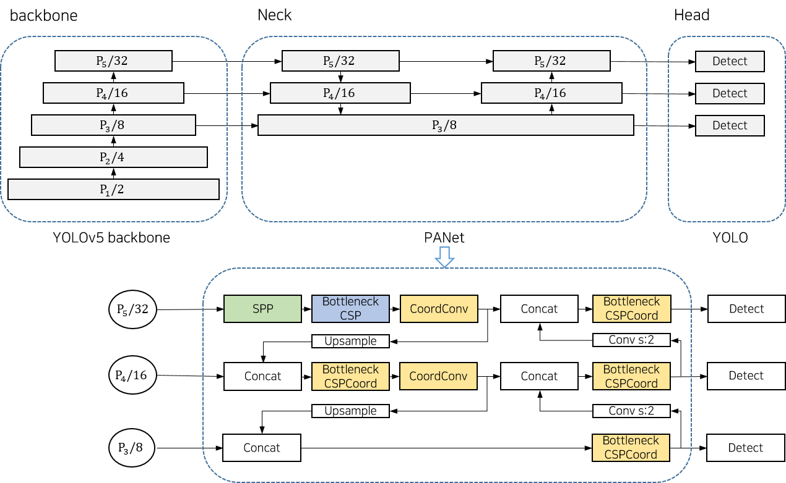
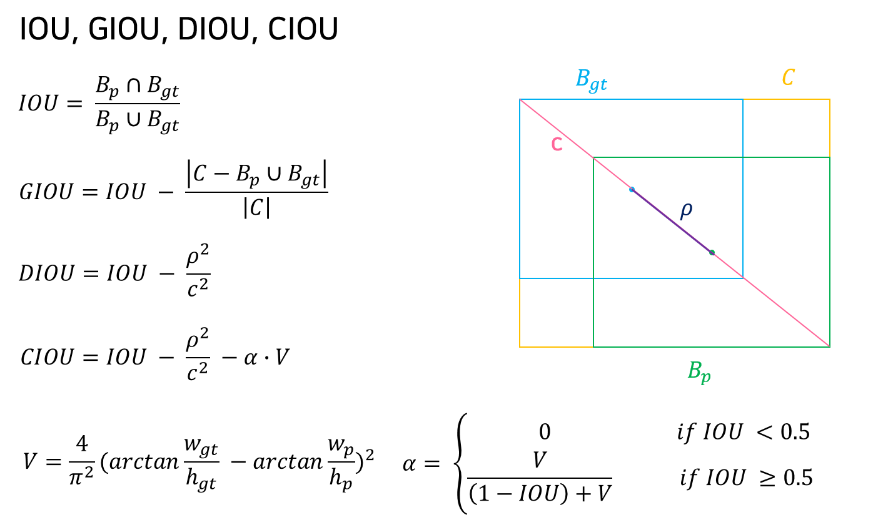
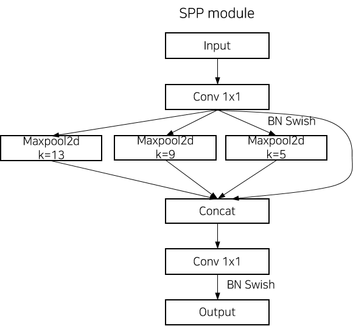
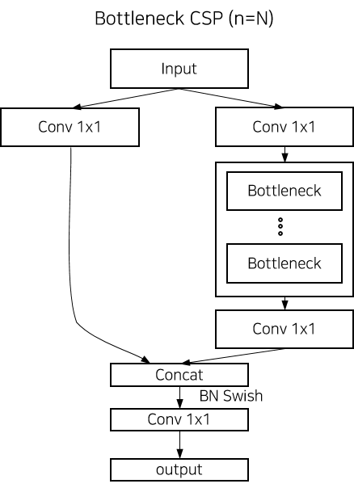
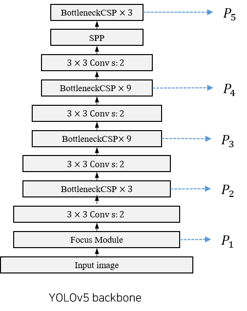
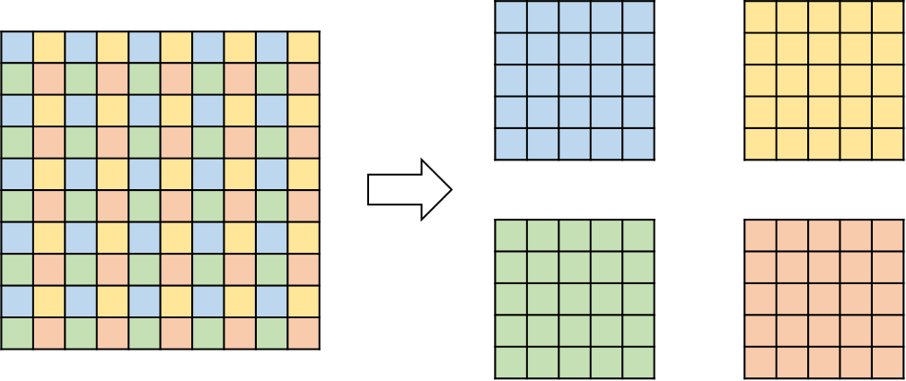
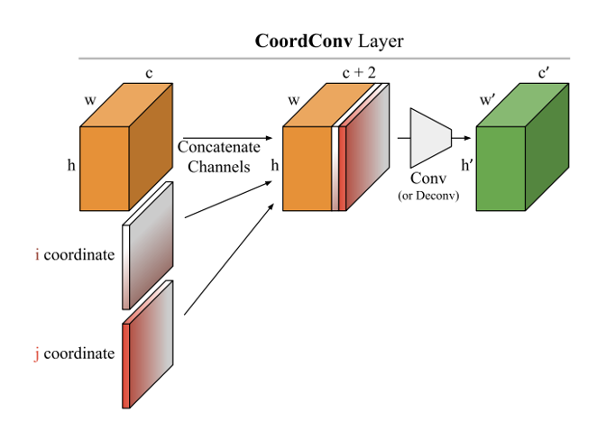
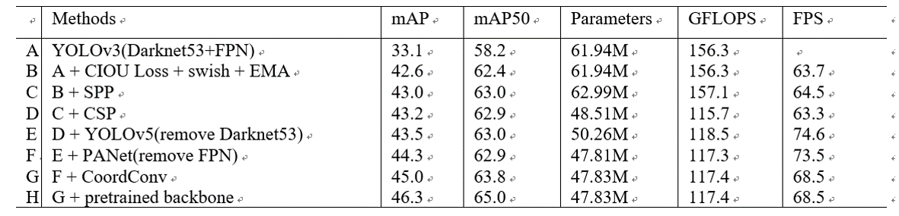

## CC-YOLO : Object Detection based YOLO with CSP and CoordConv.
Object Detection based YOLO with CSP and CoordConv.
IPIU2021 Encouragement Award [[Paper](https://drive.google.com/file/d/1NhgL0mKSCxU1_R63XJMyOwOXO7fc6MJ1/view?ths=true)]

## Abstract
we propose object detection model which is applied several modules for better performance than base model (YOLOv3).
In this paper, we provide each module what effect on detection performance.

1. CSP module - reduce parameters and amount of computation.
2. CoordConv - provide coordinate information to draw the bounding box well.
3. SPP and Focus module - enlarge the receptive field.

## Proposed model
- arichitecture

- CIOU

 

- SPP

- CSP 

- backbone

- Focus module

- CoordConv

## Result

## Contact
If you have any question, please email 'ehdrmfdl8888@naver.com'